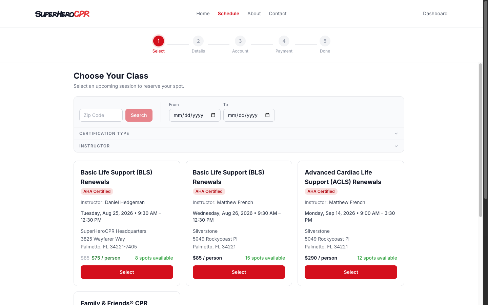
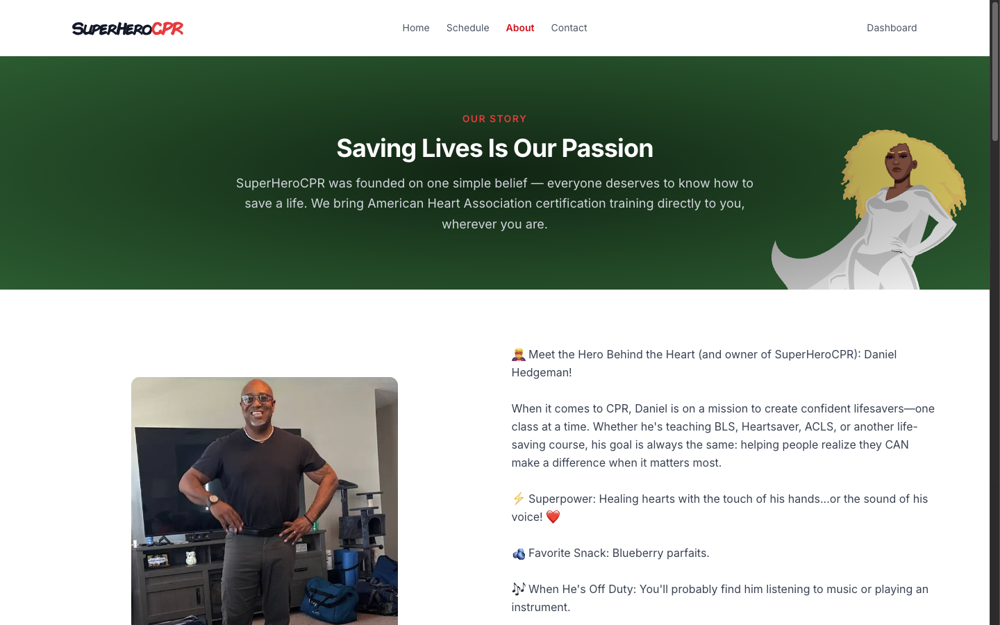
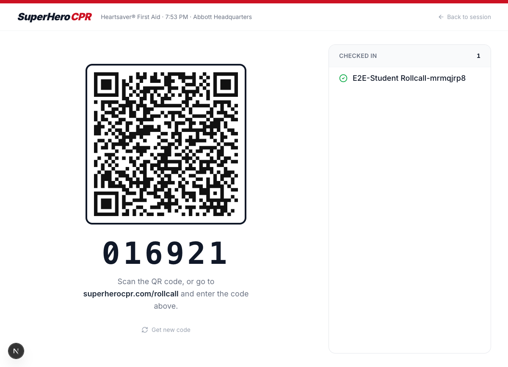

<div align="center">


### CPR & first aid certification, run like a modern SaaS product.

Booking, live rosters, instructor payouts, and staff operations for an AHA-certified CPR training business — one Next.js codebase, one Supabase backend, zero spreadsheets.

[](https://github.com/Superherocpr/Monorepo/actions/workflows/ci.yml)


[superherocpr.com](https://superherocpr.com) · [Live schedule](https://superherocpr.com/book) · [Report an issue](https://github.com/Superherocpr/Monorepo/issues)

</div>

---

## What this is

**SuperHeroCPR** is a real, revenue-generating business (AHA-certified BLS, ACLS, Heartsaver, and first-aid training across the Tampa Bay area) running on a purpose-built platform instead of an off-the-shelf booking tool. This monorepo is the entire operation: the public marketing site, the class booking and checkout flow, the customer portal, the instructor and admin back office, and the payment/payout pipeline that reconciles every dollar.

Two audiences share one codebase and one Supabase project — a public storefront and an internal operations console — with distinct visual identities, auth guards, and route groups.

<table>
<tr>
<td width="50%">

**Public site & booking**


</td>
<td width="50%">

**5-step class booking wizard**


</td>
</tr>
<tr>
<td width="50%">

**Marketing pages**


</td>
<td width="50%">

**Live student check-in (rollcall)**


</td>
</tr>
</table>

<div align="center">

<br>
<sub>Fully responsive — most bookings happen on a phone.</sub>
</div>

---

## Feature highlights

**Booking & commerce**
- Real-time class availability, waitlisting, and a 5-step booking wizard (select → details → account → payment → confirmation)
- PayPal Checkout for public payments, PayPal Invoicing for B2B billing, PayPal Payouts for instructor compensation
- Tiered promo codes and a 4-tier class add-ons system
- Shareable **team booking** links for corporate/HR buyers with CSV roster upload
- Merch storefront with its own order pipeline

**Classroom operations**
- QR-code **rollcall** self-check-in students scan on their own phones — no instructor data entry
- Day-scoped check-in codes with collision-proof uniqueness at the database layer
- Roster correction and company roster submission tools, designed to run unauthenticated on student devices
- Multi-student grading tool for BLS/ACLS classes with assistant support

**Staff & admin console**
- Session approval workflow — every class, regardless of who creates it, is reviewed before going public
- Full customer, invoice, payment, order, and location management
- Instructor payout dashboard: denial handling, retries, and fee tracking reconciled against PayPal
- Certification expiry reminders (90/60/30/7-day cron) sent automatically before a card lapses
- Role-based access for instructors, managers, and super admins

**Reliability & observability**
- A [feature → health-signal coverage map](Building/feature-health-map.md) — every feature ships with something that fails loudly if it breaks: a unit test, an outcome-driven e2e test, a SQL invariant, or a monitored cron
- Nightly canary checks and payout/webhook silence alarms catch integrations that go quiet instead of erroring
- CI runs typecheck, lint, and the unit suite on every pull request into `main` or `staging`

---

## Stack

| Layer | Technology |
|---|---|
| Frontend | Next.js 16 (App Router), React 19, TypeScript, Tailwind CSS 4 |
| Database + Auth | Supabase (Postgres, RLS) |
| Hosting | AWS Amplify |
| Payments | PayPal Checkout, PayPal Invoicing, PayPal Payouts |
| Email | Resend (transactional), Zoho Mail (contact replies) |
| File storage | AWS S3 |
| SMS | Twilio |
| Testing | Playwright (e2e), Vitest + Testing Library (unit) |
| Mobile | React Native / Expo *(planned)* |

> **Build note:** `apps/web` must build with `next build --webpack`. Turbopack breaks `@aws-sdk/client-s3` on Amplify (every S3 route returns 500). This is enforced in `apps/web/package.json` and called out in [`ci.yml`](.github/workflows/ci.yml) — don't "simplify" it away.

---

## Environments

| Environment | Branch | URL |
|---|---|---|
| Development | local | `http://localhost:3000` |
| Staging | `staging` | `https://staging.superherocpr.com` |
| Production | `main` | `https://superherocpr.com` |

Each environment has its own Supabase project and S3 bucket. Environment variables are managed per-branch in the AWS Amplify console — see [`Building/env.example.md`](Building/env.example.md) for the full variable list.

---

## Project structure

```
/
├── apps/
│   ├── web/              # Next.js application (public site + admin console)
│   ├── mcp-seo/          # SEO tooling
│   ├── images/           # Brand assets
│   └── migrations/       # Supabase SQL migrations
├── Building/
│   ├── schema.md              # Every table, column, type, and constraint
│   ├── schema-notes.md        # Workflows, email triggers, API endpoints
│   ├── DESIGN-SYSTEM.md       # Tailwind tokens, component patterns, dark mode
│   ├── FOLDER-STRUCTURE.md    # Canonical file and folder layout
│   ├── feature-health-map.md  # What signal proves each feature still works
│   ├── maintenance-overhaul.md
│   ├── PageGuides/            # Self-contained build guide for every page
│   └── env.example.md         # Environment variable documentation
└── .github/workflows/ci.yml   # Typecheck, lint, unit tests on every PR
```

Inside `apps/web/app/`, the public site and customer portal live under `(public)/`; the staff admin panel lives under `(admin)/`. Both share the same Supabase backend but have distinct visual identities and auth guards.

---

## Getting started

**1. Clone and install**
```bash
git clone https://github.com/Superherocpr/Monorepo.git
cd Monorepo/apps/web
npm install
```

**2. Set up environment variables**
```bash
cp ../../Building/env.example.md .env.local
# Fill in .env.local with your development credentials
```

**3. Set up Supabase**
- Create a Supabase project for development
- Run migrations from `apps/migrations/` in order
- Run the seed script in `Building/seed.sql` to populate initial data

**4. Run the development server**
```bash
npm run dev
```

**5. Run the test suite**
```bash
npm run test:unit   # Vitest unit tests
npm run test        # Playwright e2e tests
```

---

## Documentation

All planning documentation lives in [`Building/`](Building/). Read these before touching the code:

- [`schema.md`](Building/schema.md) — every table, column, type, and constraint
- [`schema-notes.md`](Building/schema-notes.md) — workflows, email triggers, sidebar nav, API endpoints
- [`FOLDER-STRUCTURE.md`](Building/FOLDER-STRUCTURE.md) — where every file lives
- [`DESIGN-SYSTEM.md`](Building/DESIGN-SYSTEM.md) — Tailwind tokens, component patterns, dark mode
- [`feature-health-map.md`](Building/feature-health-map.md) — the reliability contract every feature ships against
- [`PageGuides/`](Building/PageGuides/) — a self-contained build guide for every page in the application

---

## Key concepts

**Two sides, one codebase.** The public site and customer portal live under `app/(public)/`. The staff admin panel lives under `app/(admin)/`. They share the same Supabase backend but have distinct visual identities and auth guards.

**All sessions require approval.** Class sessions created by any role — instructor, manager, or super admin — go through an approval workflow before appearing publicly.

**Payments are collected centrally.** Customers pay the SuperHeroCPR business PayPal account for bookings, merch, and invoices. Instructor compensation is recorded as earnings and paid later through PayPal Payouts after a super admin reviews the payout dashboard.

**Three public tools run unauthenticated.** `/rollcall` (student check-in), `/roster/[session_token]` (roster correction), and `/submit-roster` (company roster upload) are intentionally public — they run on student phones in a classroom setting.

**A feature isn't done until it can't fail silently.** Every shipped feature has at least one health signal — a unit test, an outcome e2e test, a SQL invariant, or a monitored cron — per [`feature-health-map.md`](Building/feature-health-map.md).

---

## Contributing

See [`Building/PageGuides/`](Building/PageGuides/) for build order, coding standards, and known failure modes. All changes are developed locally, verified on `staging`, then merged to `main`. Every pull request must pass CI (typecheck, lint, unit tests) before merge.

<div align="center">
<sub>Built and operated by the SuperHeroCPR team.</sub>
</div>
